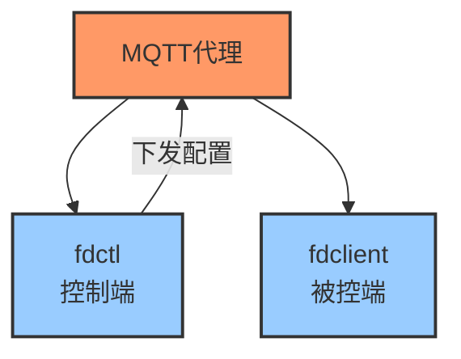

# 一个frp守护进程
基于go语言，通过MQTT协议实现一个无服务器的客户端和控制端，动态下发frp配置，远程管理多机器上的多个frp实例，让你的设备们永远不会失联。

## 通信示意图


## 安装
```
# 编译和安装
make build && make install

# 为其他平台编译
# 查看可用平台
# make cross-build
# 编译特定平台
# make cross-build GOOS=linux GOARCH=amd64
# make cross-build GOOS=darwin GOARCH=arm64
# make cross-build GOOS=windows GOARCH=amd64

# 创建systemd服务
echo "[Unit]
Description=fdclient
After=network.target

[Service]
Type=simple
ExecStart=/usr/local/bin/fdclient
Restart=on-failure

[Install]
WantedBy=multi-user.target
" > /lib/systemd/system/fdclient.service

# 重新加载systemd配置
systemctl daemon-reload

```

## 开始
1. 在主控机器，参考项目根目录下的`controller.example.yml`，获得emqx的`api_app_key`和`api_secret_key`等信息，写入`~/.frp-daemon/controller.yml`
2. 在主控机器，运行`fdctl new -name fdctl`，创建一组mqtt和client信息，写入controller.yml，因为控制端也是一个标准的client。
3. 在主控机器，运行`fdctl new -name myclient`，创建一个被控端client，
4. 在被控端机器，将上一步得到的client.yml写入`~/.frp-daemon/client.yml`。
5. 在被控端机器，设置开机启动并启动服务 `systemctl enable fdclient && systemctl start fdclient`
6. 在主控机器，运行`fdctl update -name fdctl -instance frp -version 0.51.2 -config /tmp/frpc.ini`，下发frp配置。
7. 在主控机器，运行`fdctl ping -name myclient`，测试客户端是否在线。

上述的 `~/.frp-daemon` 路径可通过设置 `FRP_DAEMON_BASE_DIR` 环境变量来改为其他路径，例如本项目代码在vscode下通过`.vscode/settings.json`设置为项目目录下的`.frp-daemon`用于开发调试。

## EMQX serverless实例说明
- 使用[emqx云平台](https://cloud.emqx.com/) serverless实例，每月免费用量大约10个设备24小时在线。
- 在部署概览（首页）页面底部创建部署API Key，其中API端点（`api_endpoint`）不含`/api/v5`，填写示例`https://<yourinstanceid>.ala.cn-hangzhou.emqxsl.cn:8443`，`App ID` 填入 `api_app_key`，`App Secret` 填入 `api_secret_key`。
- 必须使用tls连接，所以`mqtt_broker`填写`tls://<yourinstanceid>.ala.cn-hangzhou.emqxsl.cn:8883`。
- 无需下载和配置CA证书文件。

## 架构
- [cmd/fdctl, pkg/fdctl]：在主控端运行，负责生成客户端配置，{下发，删除，更新}frp实例，查看指定客户端指定frp实例状态。
- [cmd/fdclient, pkg/fdclient]：在被控端机器上运行，配置由主控端生成并储存索引，负责启动frp实例，管理frp实例，等待主控指令。
- [pkg/mqtt]：封装MQTT连接，发送，接收消息，主要作用是封装了一个点对点任务架构，允许业务层发送指令并得到结果。
- [pkg/emqx]：用于调用emqx的api，为被控端创建mqtt用户。
- [pkg/frp]：针对frp的进程管理器，用于启动停止frp实例。
- [pkg/installer]：用于安装指定版本的frp二进制文件。
- [pkg/types]：主控被控端共用的业务数据结构。

## 进度
- [✓] 下载指定版本frp二进制
- [✓] 运行多个frp实例
- [✓] 优雅关闭
- [✓] client连接MQTT等待配置下发
- [✓] `fdctl new -name <clientName>`用于创建一个新的客户端
- [✓] `fdctl ping -name <clientName>`用于测试客户端是否在线
- [✓] `fdctl update -name <clientName> -instance <instanceName> --version 0.51.2 -config temp/frpc.ini`用于更新指定实例的配置
- [✓] 实现MQTT持久会话，允许客户端不在线也可以下发配置
- [✓] `fdctl delete -name <clientName> -instance <instanceName>`用于删除指定实例
- [✓] `fdctl status -name <clientName> -instance <instanceName>`用于查看指定实例的状态
- [✓] 使用systemd管理fdclient进程
- [✓] 添加wol命令
- [✓] 添加保留消息用于上报客户端最新状态

## 引用
- [emqx](https://www.emqx.com/)
- [frp](https://github.com/fatedier/frp)
- [zerolog](https://github.com/rs/zerolog)

## 许可证
[MIT](https://opensource.org/licenses/MIT)